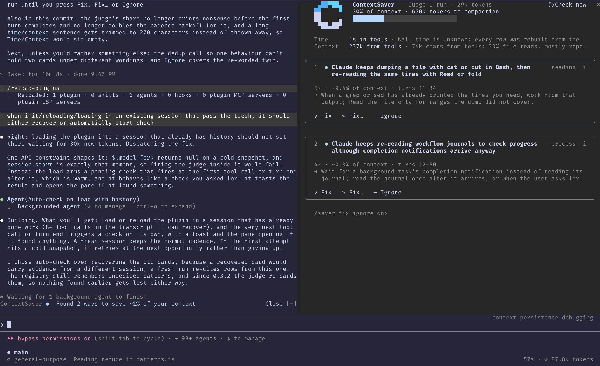

<div align="center">

<h1> &nbsp;ContextSaver</h1>

**Stop Claude Code from wasting tokens doing useless shit, in realtime.**

[](https://claude.com/claude-code) [](scripts/check.sh) [](#under-the-hood) [](LICENSE)

</div>

Half your context is garbage. Claude ran the whole test suite after a one-line edit. Then it ran it
again. It read the same file four times. It cat'd a 2,000-line log to find one traceback. It
re-summarized the plan every turn. Then the window filled up, compaction fired, and it forgot what you
were doing. You paid for all of it.

Your options right now: hit Esc, and type the same correction for the fourth time.

ContextSaver logs every tool call, then asks the model one question: **what has Claude already done
more than once that was a waste, and what should it do instead?** The answers land in a pane next to
your transcript, with three buttons.

<!-- Placeholder. Replace with a real capture:
     tmux capture-pane -e -p -t <session> | python3 scripts/screenshot.py docs/screenshot.png --cols 160 -->
<p align="center">
  
</p>

**Keep** shuts it up. **Steer** sends the line you write. **Kill** sends the fix. Nothing gets blocked,
nothing waits on you, and nothing reaches Claude unless you click it.

## Install

Function hooks are early access, so turn the flag on first — in your shell, or in
`~/.claude/settings.json` as `{ "env": { "CLAUDE_CODE_ENABLE_FUNCTION_HOOKS": "1" } }`.

```sh
export CLAUDE_CODE_ENABLE_FUNCTION_HOOKS=1
```

Then, inside Claude Code:

```
/plugin marketplace add AlmogBaku/ContextSaver
/plugin install contextsaver@contextsaver
```

That's it. No config, no API key, no dependencies, no build step. One line shows up above your prompt
after the first turn, and in a wide terminal the pane opens itself the first time the model catches
something. `/saver` opens it at any width.

> [!NOTE]
> Needs Claude Code 2.1.273 or newer (verified on 2.1.274). Install it mid-session if you want: the
> plugin reads the transcript once and rebuilds its ledger from the calls that already happened.

## Realtime context optimization, inside the session

Your context gets optimized while you are still using it: the behaviour is caught, named and changed in
the turn that is already running.

- **It names the behaviour.** "Claude keeps running the whole suite after every one-file edit — 3 times,
  ~9% of your context, 3m 12s."
- **The model calls it, not a heuristic.** Code gathers the evidence; the model decides what was stupid.
  Nothing to configure, no thresholds to tune, and it catches waste nobody wrote a rule for.
- **It shuts up when there's nothing.** One occurrence is never a finding. A wrong card costs you more
  than a missed one, so the judge is told to stay quiet unless it is sure.
- **It never touches your work.** No tool is ever denied, no output trimmed, no error hidden. If a hook
  throws, the session carries on as if the plugin weren't there.

## How it works

ContextSaver is a **Claude Mod** — a plugin built on function hooks, Claude Code's newest extension
point. That is the whole trick: it runs *inside* your session instead of reading logs afterwards, so it
sees every tool call as it happens and can talk to Claude mid-turn, while there is still time to change
what it does.

For you, it goes like this.

1. **You work exactly as you do now.** Install it and forget it. No config, no prompts, no
   interruptions. It watches quietly and says nothing.
2. **It waits for a habit, not a spike.** One big command is not a problem. The same pointless command
   for the third time is. Only behaviours that already repeated ever reach you.
3. **A card shows up in the pane, next to your transcript.** What Claude keeps doing, what it has cost
   you so far — how many times, how much of your context, how much of your life — and what it should be
   doing instead. Press `i` for the receipts: the exact calls behind the claim.
4. **You press one of three buttons.** *Keep* if you don't care, and it never mentions it again. *Steer*
   to type what Claude should do instead, the field pre-filled with the suggestion. *Kill* to send that
   suggestion as it stands.
5. **Claude changes course in the turn that's already running.** Your words reach it on its very next
   tool result, and ride along with every prompt after that, so it doesn't quietly drift back after a
   compaction. Nothing is blocked, nothing is denied, nothing waits on you.
6. **You see what you got back.** When Claude does the cheap thing instead, the pane credits the
   difference against what that behaviour normally costs you in this session: context and minutes. If
   Claude ignores you, it says so, and the card comes back so you can say it harder.
7. **Next session starts smarter.** A decision worth keeping becomes a CLAUDE.md rule, a skill, an agent
   brief or a permission rule — written only when you press `Write`.

**The technical bit,** briefly. Every tool call becomes a row: what ran, how long it took, how much it
dumped into your context, which files it touched. Every ~30k new tokens, one detached model fork reads
the session's own transcript plus that ledger and answers a single question — what has already repeated
that was a waste, and what should happen instead. There are no pattern rules or thresholds in the code
to tune; the numbers on a card are computed from the rows, not from the model's guess. The full
architecture, and the judge's prompt, are in [`docs/SPEC.md`](docs/SPEC.md).

## Commands

| Command | What it does |
|---|---|
| `/saver` | Shows or hides the pane. |
| `/saver check` | Runs the judge now instead of waiting for the cadence. |
| `/saver steer <text>` | Sends an instruction for the open (or newest) waster — the multi-line way to steer, from the composer. |
| `/saver debug` | Dumps the whole session state: rows, patterns, decisions, the judge's runs and cost, usage, savings. |
| `/saver reset` | Clears this session's ledger and decisions; the pattern registry survives. |

## Good to know

> [!IMPORTANT]
> The judge runs on your session's model. `$.model.fork` has no model field, so a session on Opus pays
> Opus to audit it. It keeps itself to a few percent of the session, and `/saver debug` shows exactly
> what it spent.

- **This is v1.** The main flow was verified in a live session and every module has tests, but function
  hooks are early access and the API under this can still move.
- **Short sessions stay quiet.** Under ~15 tool calls or 5 turns, only behaviours with three or more
  occurrences get reported.
- **A row's `ms` is wall time.** It includes the time a permission prompt sat waiting for you, so a big
  number is not automatically machine cost. The judge's prompt says so.
- **Terminal and desktop only.** On a mobile surface it keeps the ledger and draws nothing.
- **Hot reload starts a new session.** Under `--plugin-dir`, editing a file reloads the plugin: turn
  tokens, cards and decisions start empty, the ledger is rebuilt from the transcript, and the pattern
  registry survives in the store, so your past decisions still calibrate the judge.

## Under the hood

```sh
git clone https://github.com/AlmogBaku/ContextSaver && cd ContextSaver
./scripts/check.sh                                          # validate --strict, typecheck, 166 tests
CLAUDE_CODE_ENABLE_FUNCTION_HOOKS=1 claude --plugin-dir .    # run with the plugin loaded from this folder
```

All logic is pure functions over one `State` in `hooks/core/`. `hooks/register.ts` is the only file
that touches events and `$`, and every hook returns `next(e)` on any path it does not own.
`hooks/ui.tsx` is pure over two view models (`BandModel`, `PaneModel`) and never reads `State`.

Pressing `Steer` asks the surface for the keyboard: `autoFocus` only lands where a site takes the
keyboard fresh, and the click that pressed `Steer` left the ring on that Button, so the shell calls
`$.ui.focus({ requestId, key })` for the field it just opened. The ring is the person's to give — a
surface that will not move it changes nothing, and the field is still there to be clicked.

Every row is assembled and measured before it is drawn: a Button at a row's right edge gets its cells
reserved first, and a header row that does not fit drops whole segments rather than cutting a number.
The band is drawn `BAND_RESERVE` cells short of `site.bodyColumns` because the engine draws its own
collapse control `[-]` over the last cells of that row.

With `CONTEXTSAVER_DEBUG` set, `/saver demo` fills the pane with three sample wasters from
`hooks/core/demo.ts` — two awaiting a decision, one already steered so the decisions and the rules draw
too — and opens it, so the design can be looked at without waiting for a real finding. Nothing is sent
to Claude and nothing is written; without the flag the command is not there.

The build spec — architecture, module contracts, the judge prompt, the design brief, the UX
walkthrough — is [`docs/SPEC.md`](docs/SPEC.md); the product spec it implements is
[`docs/PRD.md`](docs/PRD.md).

## Theme

The pane's one accent is the theme key `suggestion` (rgb(87,105,247), ansi blue) — the engine has no
`accent` key; `suggestion` carries the same value as `permission` and the engine's own
`rate_limit_fill`. It is used on the newest waster's card border, a live waster's `●`, the gauge's
filled cells and the band's `n new`; `ButtonProps` (641-706) carries `dimColor` and `hover` and **no
`color`**, and one unknown prop blanks the whole pane, so the verbs, `Check now` and `Write` take their
tone from the surface — default at rest, inverted under the focus or the pointer. The accent marks the
block the eye must land on rather than the words inside it, and the spec says so (§5.5 item 1). The
d.ts enumerates no colour names at all (`TextProps.color` is "a theme key or a raw color", and the only
keys it ever names are `promptBorder`, `inactive` and `permission`), so there is no documented `warning`
or `error` key: the gauge's fill is the accent at every level rather than changing colour as the context
fills.

Every other waster's card is drawn with `borderDimColor`, which is the whole hierarchy of the list: the
eye lands on the accent frame first. The header, the empty state and the footer carry no rules or
frames — a blank row separates blocks, and the surface already frames the pane.

The header, the decided rows and the rules are indented to the cards' content column (`paddingX = 1 +
1 + CARD_PAD`), so every value in the pane — a header label, a card title, a decision, a rule — starts
at one x. The gauge is the spec's 16 cells and gives cells back only when the row cannot hold them. The
glyph set is closed and nothing does double duty: `→` prefixes a card's fix row and labels `kill →`,
`↪` means steered in DECIDED, `›` is the Steer field.

Inline, the drawing is budgeted against the seat the surface granted (`min(site.maxRows,
PANE_INLINE_ROWS)`), never against a constant: the header's rows, then the card's border, title, verbs
and open field, and what is left is the card's content — one row per value and one evidence quote with
`i` open, else the stats and the fix — with the remainder folding the wasters behind it. The verbs and
the field are drawn above the content, so a seat smaller than the drawing costs detail, never a verb.

The pane's layout numbers (the 10-cell gutter, the gauge and sparkline cells, the cells reserved for a
Button at a row's right edge, the rows each block spends, the glyph set, the copy strings) live at the
top of `hooks/ui.tsx` rather than in `hooks/core/types.ts`: they are private to this drawing and
`types.ts` is the shared contract, which carries no cells. Constants that more than one module reads —
the sample and debug caps, the CLAUDE.md heading, the agent brief's default tools — do live in
`types.ts`.
