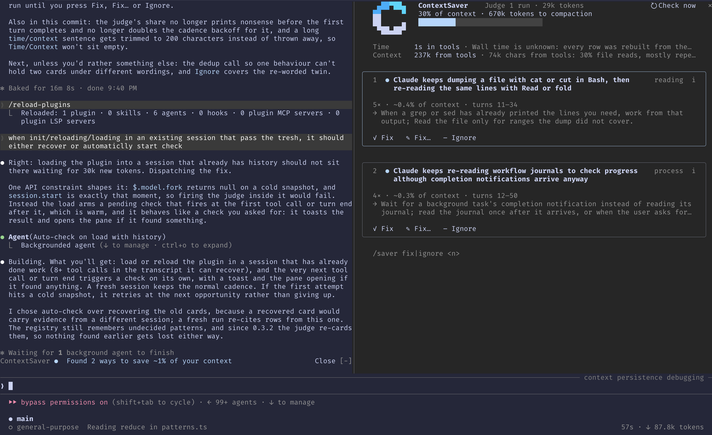

<div align="center">

<h1> ContextSaver</h1>

**Diagnoses wrong processes, wrong workflows and wrong habits in Claude Code sessions — and lets you fix them in one click.**

[](https://claude.com/claude-code) [](scripts/check.sh) [](#development) [](LICENSE)

</div>

Sessions bog down when the process is wrong. Review and fix rounds per lane, stacked on a whole-branch
review that already covers them. The premium model on mechanical stages. Agents spawned for jobs a
single command would do. The full check suite after every merge. Tool-level waste — the same file read
again, the full suite after a one-line edit — compounds on top. ContextSaver catches both: the wrong
process at the moments that matter, and the wrong habit as it builds. It gives you the measured cost
and one click to change it.

<p align="center">
  
</p>

## Features

- **It diagnoses the process, not just the calls.** "Per-lane review rounds duplicate the whole-branch
  review — 3 rounds × 3 lanes, ~4h so far. One whole-branch review reaches the same result." Process
  findings fire at moments that matter: an accepted plan, a Workflow launch, a pace complaint, every
  thirty minutes.
- **It names tool-level habits too.** "Claude keeps running the whole suite after every one-file edit —
  5×, ~9% of context, 4m each." The calls behind the claim are one keypress away.
- **Nothing to configure.** No thresholds, no rules to tune. The plugin gathers the evidence and the
  model asks the right question; that catches things nobody wrote a rule for.
- **Fixes reach every subagent.** When you fix a habit, the instruction rides the prompt of every new
  agent the session spawns. The card shows "sent ×N" so you can see it landed.
- **It works mid-turn.** Long agentic turns are checked while they run, and your fix reaches Claude on
  its next tool result, then rides every prompt after it, so it survives compaction.
- **It shows where your session went.** One line each for time and context, and a plain sentence on what
  those minutes and tokens actually bought.
- **It stays quiet.** A single occurrence is never a finding. A wrong card costs more than a missed one.
- **Fixes outlive the session.** Turn a decision into a CLAUDE.md rule, a skill, an agent brief or a
  permission rule, written only when you click `Write`.
- **It never touches your work.** No tool denied, no output trimmed, no error hidden. If a hook throws,
  your session carries on as if the plugin weren't there.

## Install

> [!NOTE]
> Needs Claude Code 2.1.273 or newer. ContextSaver is a
> [Claude Mod](https://github.com/anthropics/claude-code/tree/main/mods), built on function hooks, which
> are early access — so enable the flag first.

```sh
export CLAUDE_CODE_ENABLE_FUNCTION_HOOKS=1   # your shell, or ~/.claude/settings.json under "env"
```

Then, in Claude Code:

```
/plugin marketplace add AlmogBaku/ContextSaver
/plugin install contextsaver@contextsaver
```

That is the whole setup: no config, no API key, no dependencies, no build step. Installing mid-session
works too — the plugin reads what already happened out of the transcript and checks it right away, without
waiting for your next prompt.

## Usage

1. **Work as usual.** One line sits above your prompt and stays quiet until something repeats.
2. **A card appears** in the pane beside your transcript: what Claude keeps doing, how often, what it has
   cost you in context and minutes, and what to do instead. Press `i` for the calls behind it.
3. **Choose.** `Fix` sends the suggested fix, `Fix…` lets you reword it first, `Ignore` drops it for the
   session.
4. **Claude changes course** in the turn already running, and the pane credits what you saved — or tells
   you the instruction was ignored.
5. **Keep what worked.** Each decision is offered as a CLAUDE.md rule, a skill, an agent brief or a
   permission rule: `Write` saves it, `Try` uses it for this session only, `Skip` drops it.

> [!TIP]
> The pane docks beside your transcript in a wide terminal and sits above the prompt otherwise. `/saver`
> toggles it at any width, `ctrl+x tab` moves the keyboard into it, `Tab` cycles the buttons, `Enter`
> presses, and `Esc` hands the keys back.

### Commands

| Command | What it does |
|---|---|
| `/saver` | Show or hide the pane. |
| `/saver check` | Check now, instead of waiting for the next automatic check. |
| `/saver fix <n>` | Send card `n`'s suggested fix. |
| `/saver fix [n] <text>` | Send your own instruction instead. Without a number: the open card, else card 1. |
| `/saver ignore <n>` | Drop card `n` for the rest of the session. |
| `/saver debug` | Print the session state: ledger, findings, decisions, what the audit cost, savings. |
| `/saver reset` | Clear this session's ledger and decisions. Learned patterns survive. |

## How it works

Every tool call becomes a row in a session ledger: what ran, how long it took, how much it added to
context, which files it touched. The plugin runs two judges.

**The process judge** fires at moments that matter — an accepted plan, a Workflow launch, a pace
complaint you type, every thirty minutes. It builds a digest of what the user asked, how the work was
organised, what models ran which roles, how many merges got a check, what was re-read and what was
slow. From that, it asks: given what the user asked, how would a lean expert run this work, and where
does this session diverge? At most three findings, each with a measured cost.

**The habit judge** runs continuously — about every 30k tokens and three turns, or every 40 calls and
five minutes inside a long turn. It asks what has repeated and bogged things down, and whether there was
a shorter path. Whatever it finds becomes a card, with the costs computed from the ledger.

`Fix` on a process card sends a one-time re-plan to the main loop. `Fix` on a habit card sends a
standing instruction that rides every subsequent prompt and is also appended to every new subagent's
prompt — the card shows "sent ×N" to confirm it landed. Neither ever blocks a tool.

The architecture, the judge's prompt and the design brief are in [`docs/SPEC.md`](docs/SPEC.md); the
product spec is [`docs/PRD.md`](docs/PRD.md).

## Notes and limits

> [!IMPORTANT]
> The audit runs on your session's model, so a session on Opus pays Opus for it. It keeps itself to a few
> percent of the session's tokens, and `/saver debug` shows exactly what it spent.

- **Early access.** Function hooks are new and the API underneath can still change. Every module is
  tested and the main flow is verified live, but expect rough edges.
- **Short sessions stay quiet.** Under ~15 tool calls or 5 turns, only behaviour seen three or more times
  is reported.
- **Durations are wall time.** They include the time a permission prompt spent waiting for you, and the
  model is told as much.
- **Terminal and desktop only.** On mobile surfaces the plugin keeps its ledger and draws nothing.
- **The band speaks for dead turns and running workflows.** After a turn that ended in an API error or a
  refusal it reads `✕ Last turn ended in … · type anything to continue` until your next prompt; while a
  workflow runs and nothing is found it names the run, its stage, its agents and their calls.

## Development

```sh
git clone https://github.com/AlmogBaku/ContextSaver && cd ContextSaver
./scripts/check.sh                                          # validate --strict, typecheck, tests
CLAUDE_CODE_ENABLE_FUNCTION_HOOKS=1 claude --plugin-dir .    # run Claude Code with this folder loaded
```

All logic is pure functions over a single `State` in `hooks/core/`. `hooks/register.ts` is the only file
that touches events, and every hook falls back to `next(e)` on any path it does not own. `hooks/ui.tsx`
renders two view models and never reads `State`. With `CONTEXTSAVER_DEBUG=1`, `/saver demo` fills the
pane with sample cards, so the drawing can be worked on without waiting for a real finding.

Under `--plugin-dir`, editing a file hot-reloads the plugin and resets session state. Learned patterns
persist in the plugin store.

## License

MIT © Almog Baku. See [LICENSE](LICENSE).
